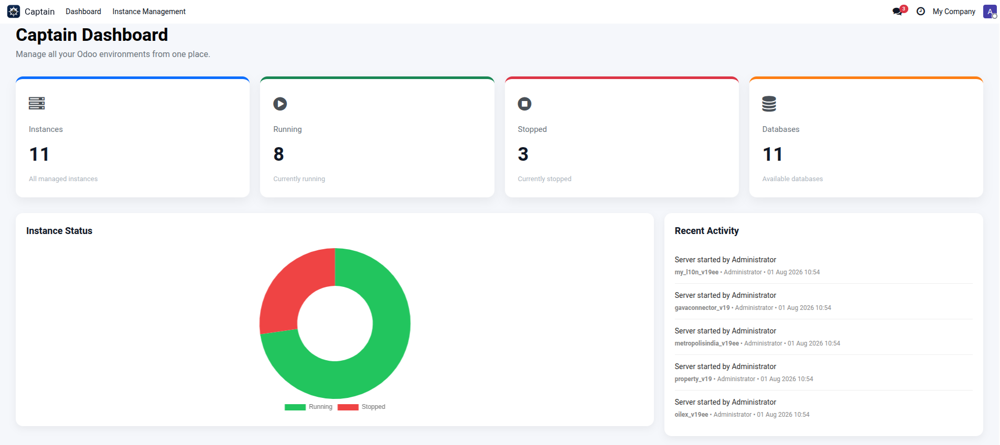
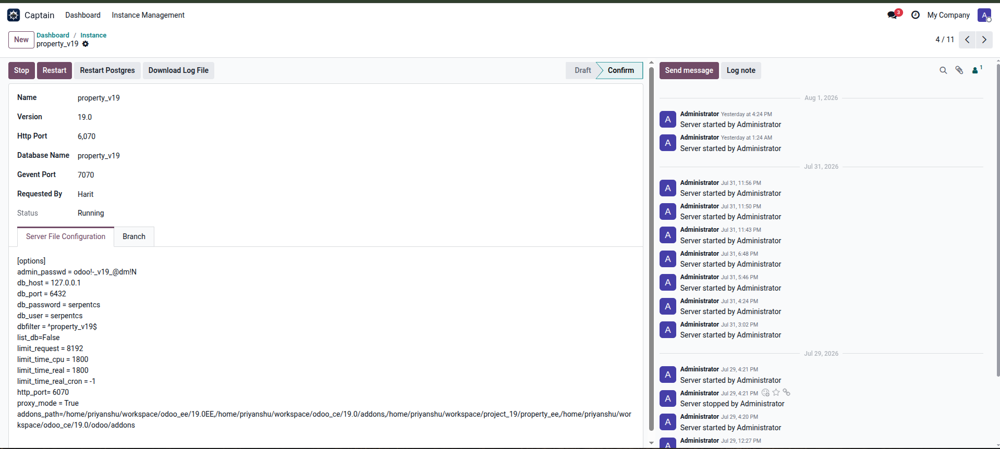
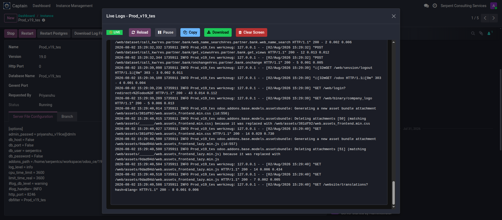
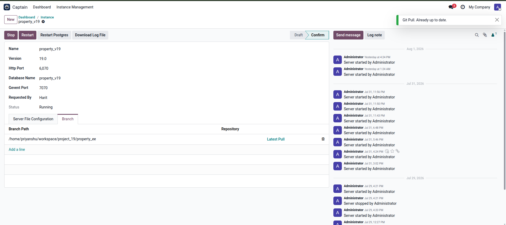

# ⚓ Captain – Open Source Odoo Infrastructure Management Platform

<p align="center">

<h3>Command Your Odoo Infrastructure</h3>

Manage multiple Odoo instances, monitor live logs, deploy the latest code, and control your Odoo infrastructure from one beautiful dashboard.

Built for **Odoo Developers**, **System Administrators**, **DevOps Engineers**, **Hosting Providers**, and **Odoo Partners**.

</p>

<p align="center">


</p>

---

# 🚀 What is Captain?

Captain is an **Open Source Odoo Infrastructure Management Platform** that simplifies the administration of multiple Odoo environments.

Instead of managing Odoo instances using SSH, terminal commands, configuration files and manual log inspection, Captain provides a clean and intuitive interface directly inside Odoo.

Whether you're managing:

- Development Environments
- Staging Servers
- Production Servers
- Client Projects
- Internal Demo Instances

Captain helps you manage everything from a single dashboard.

---

# 📸 Dashboard

<p align="center">

</p>

The dashboard provides a real-time overview of your infrastructure.

### Dashboard Highlights

- Total Odoo Instances
- Running Instances
- Stopped Instances
- Total Databases
- Instance Status Chart
- Recent Activity Timeline

No terminal commands.

No manual tracking.

Everything is visible in one place.

---

# 🚀 Instance Management

<p align="center">

</p>

Captain allows you to manage every Odoo instance from a single interface.

### Features

- Create Odoo Instances
- Multi Odoo Version Support
- Start Instance
- Stop Instance
- Restart Instance
- Bulk Start Multiple Instances
- Restart PostgreSQL
- Download Log Files
- Live Log Viewer
- Configuration Management
- Branch Management
- Git Integration
- Chatter History

No SSH required.

---

# 📜 Live Log Viewer

<p align="center">

</p>

One of Captain's most powerful features.

Monitor your Odoo logs in real time without downloading log files.

### Features

- Live Log Streaming
- Reload Logs
- Pause / Resume
- Auto Follow
- Copy Logs
- Download Logs
- Clear Screen
- Efficient Offset-Based Reading
- Handles Large Log Files Efficiently

Perfect for debugging production and development environments.

---

# 🔀 Git Integration

<p align="center">

</p>

Deploy the latest code directly from Captain.

### Features

- Pull Latest Changes
- Manage Repository Branches
- Track Branch Paths
- Deploy Without Opening a Terminal

Designed for teams managing multiple Odoo projects.

---

# 🔒 Role Based Access

Captain includes two built-in roles.

## 👑 Instance Manager

Full administrative access.

Managers can:

- Create Instances
- Modify Configurations
- Manage Users
- Start / Stop / Restart Instances
- Bulk Start Instances
- Restart PostgreSQL
- Pull Latest Git Changes
- Access All Logs
- Manage Branches
- View Every Instance

---

## 👤 Instance User

Limited access designed for developers and support engineers.

Users can:

- View Assigned Instances
- Start Assigned Instances
- Stop Assigned Instances
- Restart Assigned Instances
- View Live Logs
- Download Logs
- Access Only Assigned Instances

Administrators decide exactly which instances each user can access.

---

# 🐘 PostgreSQL Integration

Captain can also manage PostgreSQL services.

Current Features

- Restart PostgreSQL Service

Future versions will include:

- Database Backup
- Database Restore
- Database Monitoring

---

# 🌟 Why Captain?

Managing multiple Odoo environments usually requires:

- SSH Sessions
- systemctl Commands
- Git Commands
- PostgreSQL CLI
- Log Downloads
- Configuration Files
- Multiple Browser Tabs

Captain centralizes everything into one simple dashboard.

Spend less time managing infrastructure and more time building applications.

---

# ✨ Current Features

| Feature | Status |
|----------|--------|
| Dashboard | ✅ |
| Multi Odoo Version Support | ✅ |
| Instance Management | ✅ |
| Start / Stop / Restart | ✅ |
| Bulk Start | ✅ |
| Git Pull | ✅ |
| Branch Management | ✅ |
| Live Log Viewer | ✅ |
| Download Logs | ✅ |
| PostgreSQL Restart | ✅ |
| User Permissions | ✅ |
| Recent Activity | ✅ |

---

# 🛣 Roadmap

## Version 1.x

- ✅ Dashboard
- ✅ Live Log Viewer
- ✅ Bulk Start
- ✅ Git Integration
- ✅ Branch Management
- ✅ User Permissions
- ✅ PostgreSQL Restart

---

## Version 2

- CPU Monitoring
- RAM Monitoring
- Disk Monitoring
- Worker Monitoring
- Database Backup
- Filestore Backup
- Search Inside Logs
- Colored Log Viewer
- Bulk Stop
- Bulk Restart
- Deployment History

---

## Future

- Docker Integration
- Kubernetes Support
- Multi Server Management
- Prometheus Integration
- Grafana Integration
- Health Monitoring
- Remote Agent
- Automatic Deployments

---

# ⚙ Installation

Clone the repository.

```bash
git clone https://github.com/priyanshuthakar24/captain.git
```

Copy the module into your custom addons directory.

Update the Apps List.

Install **Captain**.

Configure:

- Odoo Instance User
- Log Directory
- Odoo Versions

You're ready to manage your infrastructure.

---

# 🏗 Built With

- Odoo 19 Community
- Python
- JavaScript
- OWL Framework
- PostgreSQL
- SCSS

---

# 🤝 Contributing

Contributions are welcome.

If you'd like to improve Captain:

1. Fork the repository
2. Create a feature branch
3. Commit your changes
4. Open a Pull Request

Bug reports and feature suggestions are always appreciated.

---

# 📄 License

Captain is released under the **LGPL-3 License**.

---

# ⭐ Support Captain

If Captain helps you manage your Odoo infrastructure, consider giving the repository a ⭐.

It helps the project grow and motivates future development.

---

# 👨‍💻 Author

**Priyanshu Thakar**

DevOps Engineer | Odoo Infrastructure | Open Source Enthusiast

GitHub

https://github.com/priyanshuthakar24

---

## ⚓ Captain

**Command Your Odoo Infrastructure**